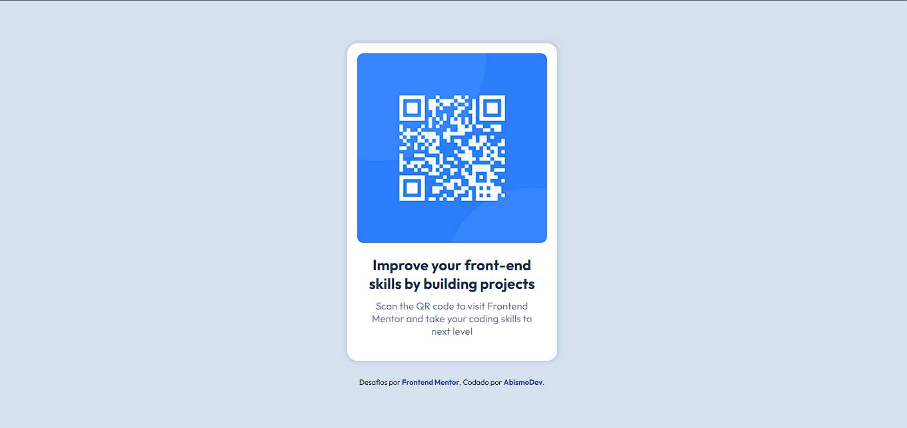

# Frontend Mentor - QR code component solution

This is a solution to the [QR code component challenge on Frontend Mentor](https://www.frontendmentor.io/challenges/qr-code-component-iux_sIO_H). Frontend Mentor challenges help you improve your coding skills by building realistic projects. 

## Table of contents

- [Overview](#overview)
  - [Screenshot](#screenshot)
  - [Links](#links)
- [My process](#my-process)
  - [Built with](#built-with)
- [Author](#author)

## Overview

### Screenshot

### Links

- Live Site URL: [Live Site](https://qr-code-component-abismodev.vercel.app/)

## My process

### Built with

- Semantic HTML5 markup
- Styled with CSS3
- Flexbox

## Author

- Website - In construction
- Frontend Mentor - [@AbismoDev](https://www.frontendmentor.io/profile/AbismoDev)
- Instagram - [@Welli.18](https://www.instagram.com/welli.18/)
